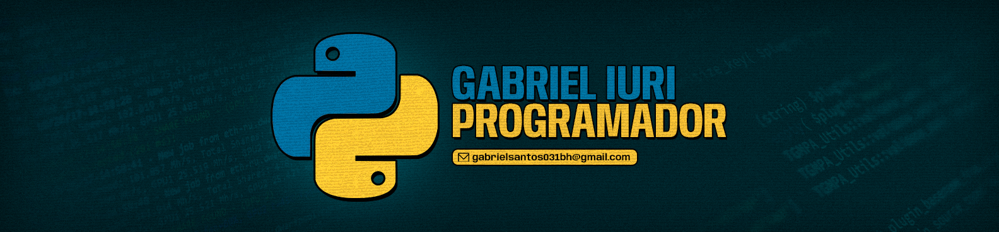

<h1 align="center">Hello World</h1>

###

<h3>Sobre: </h3>

  Desenvolvedor Front End com foco em Next e React, com experiência de estudos desde julho de 2023.  
  Busco constantemente aprimorar minhas habilidades por meio de cursos, incluindo uma formação profissionalizante presencial.
   
  Resido em Belo Horizonte, tenho 18 anos e estou entusiasmado em contribuir para projetos desafiadores e inovadores na área de desenvolvimento web.

###

 

  <h3>GitHub Status</h3>
  
  

###

 

  <h3>Minha Stack: </h3>
  
  
  
  
  
  
  
  
  
  
  
  
  
  
  
  
  

###

  <h3>Minhas Redes de Contato: </h3>
  
  
  

##

 

###
